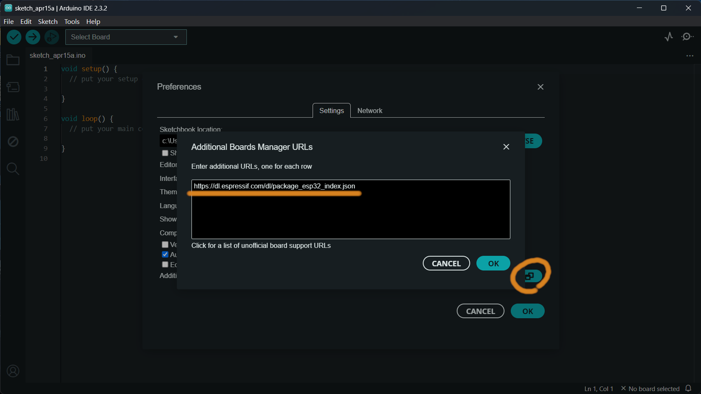
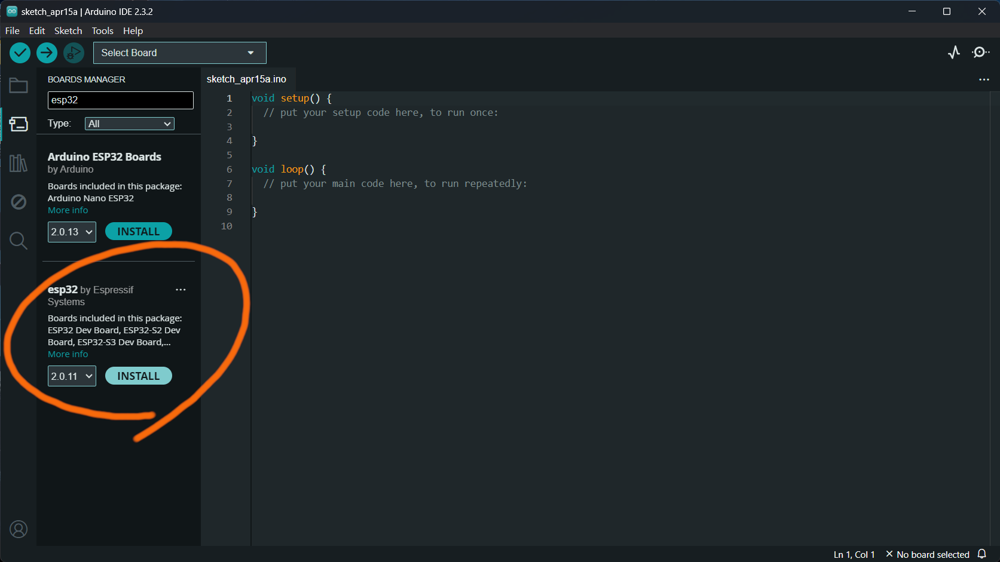
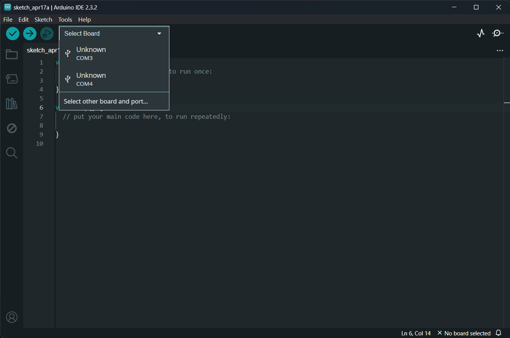
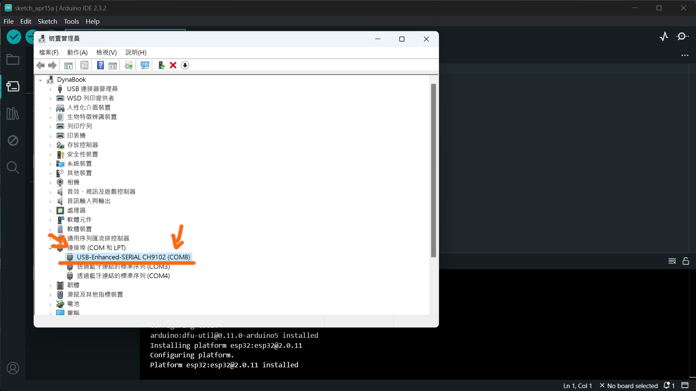
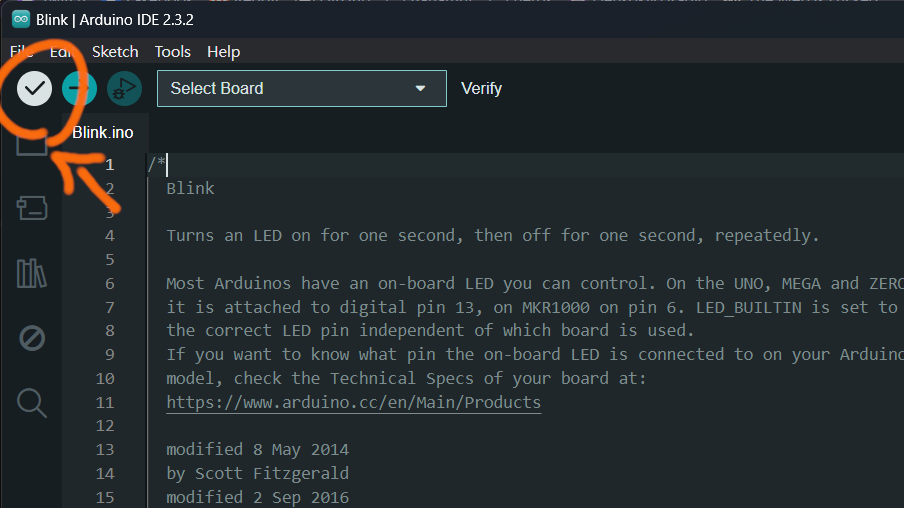
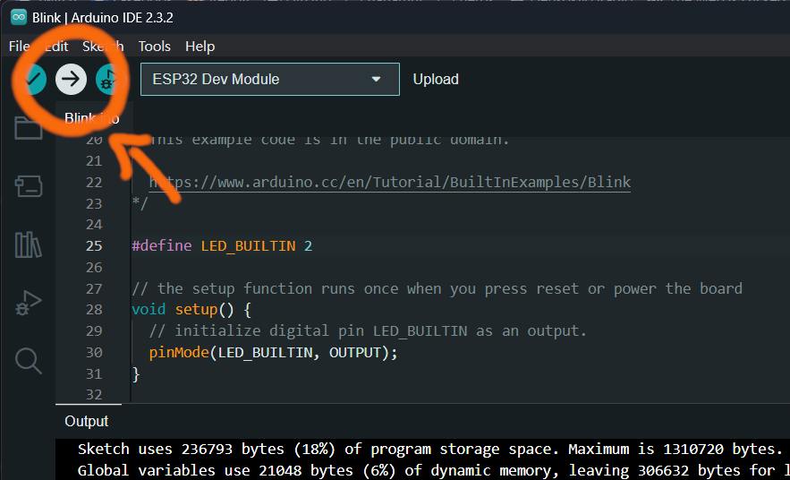

電機社終於要教硬體，問題就是我也沒玩過

## ESP32 是什麼

> ESP32 是一系列低成本，低功耗的單晶片微控制器，整合了Wi-Fi和雙模藍牙。
> -- [維基百科](https://zh.wikipedia.org/zh-tw/ESP32)

簡單來講就是一系列的微控制器晶片，搭配程式後可以用來控制各種東西。

> [!NOTE]
> 你可能聽過 Arduino、Micro:bit
>
> 這些都是微控制器（Micro-controller），可以透過程式幫你完成事情。
> 它們之間都有不同的特色、不同的功能，我們就不詳細比較。
> _其實我也不清楚，不過 Arduino 和 ESP32 的蠻多零件都可以相容_

你最常看到的 ESP32 大概會長這樣：


不過其實 ESP32 本 E 是上面的那一塊晶片，剩下的針腳、感測器、電路就是開發版的一部分。
因此，你在網路上可以找到很多種 ESP32 板，每種都包含不同的腳位、感測器，但它們都會包含其中一種 ESP32 晶片。

## 開始使用 ESP32

### 安裝開發環境

在把 ESP32 接上電腦前，先來把開發環境裝好

1. **安裝 Arduino IDE**

   [Software | Arduino](https://www.arduino.cc/en/software)

   _有點 NTR 的味_

   用 Arduino IDE 大概是寫 ESP32 程式最簡單的方法了，所以你各位得裝：）

2. **設定 Arduino IDE 使用 ESP32**

   這邊需要做幾個步驟：

   1. 在「檔案 > 喜好設定 > 額外的開發板管理員網址」，新增這個網址：

      https://dl.espressif.com/dl/package_esp32_index.json

      

   2. 在「開發版管理員」，搜尋並安裝 ESP32：

      

裝完就 OK 了！這下 Arduino IDE 就可以用來編譯 ESP32 了

### 連接電腦

用條 USB 接到電腦就好了，這不用教吧

### 讓 Arduino IDE 連接 ESP32

你可能需要自己在 Arduino IDE 選擇你的 ESP32 板子：



如果有好幾個選項，你最好查一下裝置管理員看哪個是我們的板子：



找到板子是 COM 多少，就能去 Arduino IDE 找他了

> [!CAUTION]
> 如果需要選開發版類型，我們要選的是「ESP32 Dev Module」，搜尋一下應該就找得到了。

### 第一支程式

有了開發環境、有了板子，就可以寫第一支程式了！
我們要讓板子上的 LED 閃爍，一下亮、一下暗，這基本上就是開發版界的 Hello World 了。

我們可以直接在 Arduino IDE 裡的「檔案 > 範例 > 01.Basics > Blink」找到使 LED 閃爍的程式，
IDE 裡已經內建了：）

你會看到類似這樣的程式碼：

```c
/*
  Blink

  Turns an LED on for one second, then off for one second, repeatedly.
  ...
*/

// the setup function runs once when you press reset or power the board
void setup() {
  // initialize digital pin LED_BUILTIN as an output.
  pinMode(LED_BUILTIN, OUTPUT);
}

// the loop function runs over and over again forever
void loop() {
  digitalWrite(LED_BUILTIN, HIGH);  // turn the LED on (HIGH is the voltage level)
  delay(1000);                      // wait for a second
  digitalWrite(LED_BUILTIN, LOW);   // turn the LED off by making the voltage LOW
  delay(1000);                      // wait for a second
}
```

點左上角的「驗證」看看：



如果發生錯誤，這是正常的。錯誤訊息說我們沒有 `LED_BUILTIN` 這個東西：

```txt nonumbers
C:\...\.arduinoIDE-something\Blink\Blink.ino: In function 'void setup()':
C:\...\.arduinoIDE-something\Blink\Blink.ino:28:11: error: 'LED_BUILTIN' was not declared in this scope
   pinMode(LED_BUILTIN, OUTPUT);
           ^~~~~~~~~~~
C:\...\.arduinoIDE-something\Blink\Blink.ino: In function 'void loop()':
C:\...\.arduinoIDE-something\Blink\Blink.ino:33:16: error: 'LED_BUILTIN' was not declared in this scope
   digitalWrite(LED_BUILTIN, HIGH);  // turn the LED on (HIGH is the voltage level)
                ^~~~~~~~~~~

exit status 1

Compilation error: 'LED_BUILTIN' was not declared in this scope
```

因為這支程式是為 Arduino 寫的，但我們用的 ESP32。
既然他說沒有 `LED_BUILTIN`，那我們就自己指定吧！

[Google 一下](https://www.google.com/search?q=esp32+builtin+led+pin)，我們知道 ESP32 的內建 LED 在第 2 針腳，
那我們就指定在程式裡：

```c
/*
  Blink ...
*/

#define LED_BUILTIN 2 // define pin 2 as builtin-led

// the setup function runs once when you press reset or power the board
void setup() {
...
```

驗證後，應該就沒問題了。接下來，就上傳看看吧：



完成後的輸出大概會長這樣：

```txt nonumbers
Writing at 0x00000000... (00%)
Writing at 0x00000000... (00%)
Writing at 0x00000000... (00%)
Writing at 0x00000000... (100%)
Wrote 123456 bytes (123456 compressed) at 0x00000000 in 0.0 seconds (effective 0000.0 kbit/s)...

Hash of data verified.

Leaving...
Hard resetting via RTS pin...
```

那應該就成功了。看看你的 ESP32 上有沒有 LED 在閃吧！

## 連接其他感測器

🚧 UNDER CONSTRUCTION 🚧
