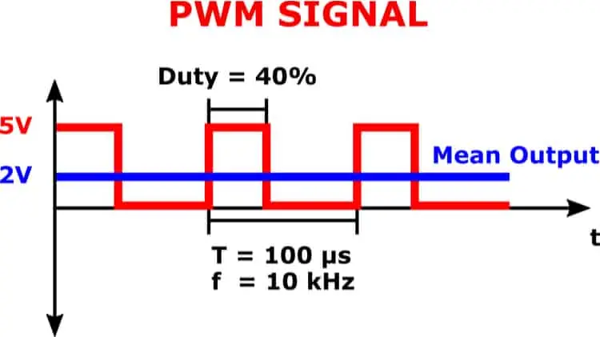
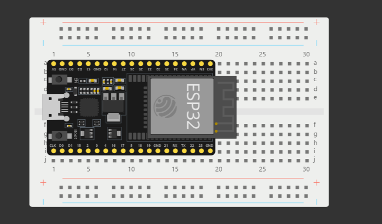
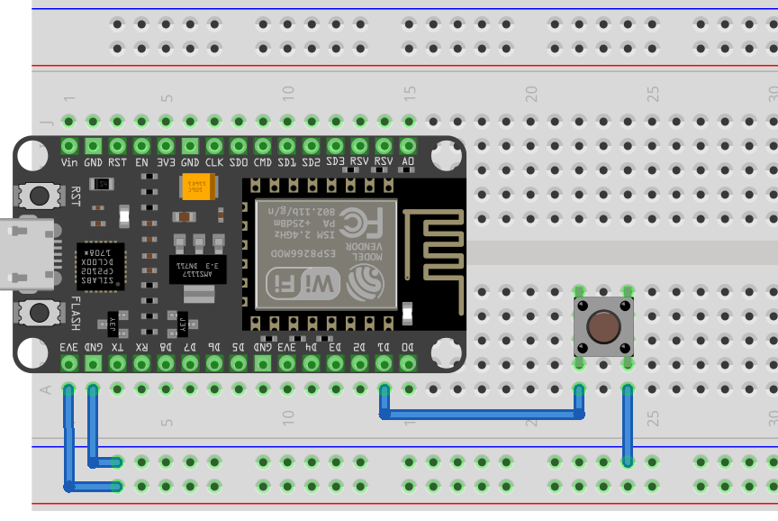

都花錢買了一堆零件，那肯定要用用看吧

## 板子上的模組

首先，還是看到手上的這塊 ESP32 開發板。
它上面除了整個微控制器的核心，還有許多已經內建的零件。我們先來用用看這些吧。

### 內建 LED

內建 LED 應該是大家最熟悉的部份吧，畢竟它最常被我們拿來 Blink 測試板子有沒有問題。

```c
void loop() {
  digitalWrite(BUILTIN_LED, HIGH); // 設成高電位（亮）
  delay(1000); // 等待 1 秒
  digitalWrite(BUILTIN_LED, LOW); // 設成低電位（暗）
  delay(1000); // 等待 1 秒
}
```

不過 LED 可不是只有暗或亮兩個選項。它有這麼多種亮度可以發出來，不用就太可惜了吧？
透過 PWM 訊號，調整 Duty Cycle，LED 的亮度就會改變。



在 Arduino IDE 裡發出不同 Duty Cycle 的訊號也很簡單：

```c
analogWrite(BUILTIN_LED, VALUE); // VALUE 為數值，範圍 0 ~ 255
```

這樣 LED 就可以顯示不同亮度了！透過亮度，就很容易能表示一個數值（像是時間、距離、溫度）的大小了吧！

我順便做了個（類）呼吸燈來用：）

```c
int brightness = 0;

void loop() {
  while (brightness <= 255) {
    analogWrite(LED_BUILTIN, brightness++);
    delay(10);
  }
  while (brightness >= 0) {
    analogWrite(LED_BUILTIN, brightness--);
    delay(10);
  }
}
```

### 按鈕

我們知道板子上的 EN 按鈕是重置用的，可以讓板子的程式重新開始；至於 BOOT，是用來讓開發版進入 Bootloader，進行程式或韌體的上傳。
不過有些板子在上傳程式時不需要按著 BOOT，因為每張開發版上有的零件不大一樣。

重點是，BOOT 按鈕是連接到 GPIO0，意味著我們可以透過程式讀取到它的狀態，作為輸入（Input）的管道。

> [!IMPORTANT]
> 按鈕在釋放時是**高電位**（`HIGH`）、按下時是**低電位**（`LOW`）。

這樣，我們就能寫個簡單的程式：

```c
void loop() {
  if (digitalRead(0) == LOW) { // 如果 GPIO0 （BOOT 按鈕）是低電位（按著）
    digitalWrite(LED_BUILTIN, HIGH); // 就對 LED 送出高電位（亮）
  } else {
    digitalWrite(LED_BUILTIN, LOW); // 按鈕釋放就送出低電位（暗）
  }
  delay(10);
}
```

### WiFi

參考：

- https://shop.mirotek.com.tw/iot/esp32-start-23/
- https://randomnerdtutorials.com/esp32-useful-wi-fi-functions-arduino/

WiFi 和藍芽一樣，底層邏輯已經有函式庫幫忙寫好了，我們只要知道如何調用它們提供的 API 就行了。
那就來看看這個 `WiFi` 函式庫怎麼用：

1. **連接 WiFi 網路**

```c
#include <WiFi.h> // 調用 WiFi.h （函式庫的標頭檔）
const char *ssid     = "********"; // ssid: 網路名稱
const char *password = "********"; // pasword: 網路密碼

void setup() {
  Serial.begin(115200);

  // 連接 WiFi
  WiFi.begin(ssid, password);
  Serial.printf("Connecting to %s", ssid);

  // 檢查 WiFi 狀態，如果未連接就執行迴圈
  while (WiFi.status() != WL_CONNECTED) {
    delay(500);
    Serial.print(".");
  }

  Serial.println("\n--------------------");

  // 讀取 IP 位置
  Serial.print("IP address: ");
  Serial.println(WiFi.localIP());

  Serial.println("--------------------");

  // 顯示WiFi連線狀態資訊：工作模式、Channel、SSID、Passphrase、BSSID
  Serial.println("WiFi status:");
  WiFi.printDiag(Serial);
}

void loop() { }
```

2. **設定 WiFi 模式、掃描 WiFi 網路**

這邊 WiFi 有 3 種模式，並用 `WIFI.mode()` 設定：

| 模式代號    | WiFi 模式         | 說明                                   |
| ----------- | ----------------- | -------------------------------------- |
| WIFI_AP     | Access Point (AP) | 熱點，可以讓其他設備接入。             |
| WIFI_STA    | Station (STA)     | 無線終端模式，可以連接其他 WiFi 網路。 |
| WIFI_AP_STA | AP+STA            | 兩個模式並存。                         |

```c
#include "WiFi.h"

void setup() {
  Serial.begin(115200);

  // 設定為連接（無線終端）模式
  WiFi.mode(WIFI_STA);
}

void loop() {
  Serial.println("scan start");

  // WiFi.scanNetworks() 回傳找到的 WiFi 網路數目
  int n = WiFi.scanNetworks();
  Serial.println("scan done");

  if (n == 0) {
      Serial.println("no networks found");
  } else {
    Serial.print(n);
    Serial.println(" networks found");

    for (int i = 0; i < n; ++i) {
      // 印出找到的 WiFi 網路的資訊
      Serial.print(i + 1);
      Serial.print(": ");
      Serial.print(WiFi.SSID(i)); // 網路名
      Serial.print(" (");
      Serial.print(WiFi.RSSI(i)); // 強度
      Serial.print(")");
      Serial.println((WiFi.encryptionType(i) == WIFI_AUTH_OPEN)?" ":"*"); // 加密狀態
      delay(10);
    }
  }
  Serial.println("");

  // 等一下再掃一次
  delay(5000);
}
```

網路模組還有其他很多功能，像是網路連接的 TCP、UDP 協定，甚至可以做 HTTP、HTTPS、Server、DNS Server 等等，
雖然那些並不是 WiFi 的範圍，但也是 Networking 的一環，不過這堆東西我就講不完啦

### 藍芽

參考：https://shop.mirotek.com.tw/iot/esp32-start-19/

藍芽的話，我們也是使用內建的函式庫 `BluetoothSerial`，接下來要做的就是連接與資料傳輸了。

1. **初始化**：`SerialBT.begin("藍芽裝置名字")`
2. **讀文字**：`SerialBT.read()`
3. **寫文字**：`SerialBT.write("內容")`

所以，以下就是個從電腦 Serial Console 讀取文字、在送到藍芽的程式：

```c
#include <BluetoothSerial.h>
// 創建 BluetoothSerial 的實例（instance）
BluetoothSerial SerialBT;

void setup() {
  Serial.begin(115200);
  SerialBT.begin("ESP32_BT"); // 藍牙顯示名稱，可自行更改，需避免與他人重複命名
}

void loop() {
  // 確認有內容讀取
  if (Serial.available()) {
    // 在 SerialBT 寫入 Serial 讀取的東西
    SerialBT.write(Serial.read());
  }

  // 確認有內容讀取
  if (SerialBT.available()) {
    // 在 Serial 寫入 SerialBT 讀取的東西
    Serial.println(SerialBT.readString());
  }
  delay(50);
}
```

> [!NOTE]
> 使用「Arduino Bluetooth Control」App 可以透過藍芽和開發板傳送文字。
>
> 
>
> 詳細使用方式詳見：https://shop.mirotek.com.tw/iot/esp32-start-19/

---

接下來，就來看看有什麼其他零件可以接上吧。

但首先，我們有這麼多零件，要怎麼把它們都接上去啊？
尤其在 3V3 和 GND 腳位少的開發版上，直接把線插上針腳就沒辦法一次使用好幾個零件。
但我們測試用的東西又不可能直接焊接上去。

所以，我們需要另一塊板子幫我們連接電線，又不能直接黏死。這就是麵包板的用處啦

## 麵包板

> 麵包板（英語：Breadboard）或叫免焊萬用電路板（solderless breadboard），為電子電路設計中常用的一種基底。
> 與印刷電路板不同，麵包板無需焊接或損壞電路軌道，因此可以反覆使用。
> 麵包板非常適合用於打造原型產品，在學生和技術教育領域非常受歡迎。
> ——[麵包板 - 維基百科](https://zh.wikipedia.org/zh-hant/%E9%9D%A2%E5%8C%85%E6%9D%BF)

總之，就是讓你簡單接線的板子。因為它已經在裡面幫你接好了。


接著把 ESP32 放到麵包板上，大概會長這樣：



不過看到上面的圖你可能會發現，ESP32 有一邊的針腳剛好在麵包板的最後一排，這應該就是尺寸規格的問題啦。
那邊接線大概就接不到了，所以 3V3 的針腳確認一下要在接得出來的地方。


剩下的針腳就一樣是自由運用了！

## LED

一樣，我們先從最簡單的開始。

上面我們已經有提到內建 LED 的使用，另外的 LED 接上去也不會差太多。
我們就簡單帶過吧

1. **接線**

> [!CAUTION]
> LED 的長腳（正極）要接到 GPIO、短腳（負極）要接到接地！
>
> 不然可能會損害到 LED 喔。


2. **Blink**

這個大家應該也看過好幾次了，我們就速速*直接照抄*吧

```c
// 注意：記得自己定義你的 LED_PIN 針腳，或直接寫在下面程式！
void setup() {
  pinMode(LED_PIN, OUTPUT);
}

void loop() {
  digitalWrite(LED_PIN, HIGH);
  delay(1000);
  digitalWrite(LED_PIN, LOW);
  delay(1000);
}
```

3. **變換亮度**

這個在上面也提過了，只要用 PWM 訊號，調整 Duty Cycle 就可以改變亮度了：

```c
int brightness = 0;

void loop() {
  while (brightness <= 255) {
    analogWrite(LED_PIN, brightness++);
    delay(10);
  }
  while (brightness >= 0) {
    analogWrite(LED_PIN, brightness--);
    delay(10);
  }
}
```

## 按鈕

按鈕應該是最常見、也是最直覺的輸入裝置了。
他的構造也很簡單，就是兩條電線、按鈕按下去就會接通。

1. **接線**



> [!TIP]
> 電源的部份也可以接在接地（GND）上。這會反應在你讀取的電位高低上：
>
> | 按鈕電源 | 釋放時的電位 | 按壓時的電位 | 連接電阻          |
> | -------- | ------------ | ------------ | ----------------- |
> | VCC      | 低           | 高           | 下拉（pull-down） |
> | GND      | 高           | 低           | 上拉（pull-up）   |
>
> 上拉或下拉電阻可以讓零件沒有訊號（高阻抗）的時候，
> 保證讀取到的訊號是高或低電位。
> 在上面的表格裡，可以看到「釋放時的電位」就是高阻抗的時候，
> 這時下拉電阻就可以保證讀取到的訊號是 LOW。
>
> 而上拉或下拉電阻在開發板裡面已經有內建，所以在指定 `pinMode()` 的時候，
> 只要指定 `INPUT_PULLUP` 或 `INPUT_PULLDOWN` 就好了喔。

2. **按壓時觸發 LED**

接上按鈕，只要讀到高或低的觸發電位，就讓 LED 亮起來！

```c
// 注意上面的表格，設定要設對，讀取也要讀對！
#define BUTTON_PIN 5
#define LED_PIN 23

void setup() {
  pinMode(BUTTON_PIN, INPUT_PULLUP);
  pinMode(LED_PIN, OUTPUT);
}

void loop() {
  if (digitalRead(BUTTON_PIN) == HIGH) {
    digitalWrite(LED_PIN, HIGH);
  } else {
    digitalWrite(LED_PIN, LOW);
  }
  delay(100);
}

```

## 觸摸按鈕

參考：https://esp32io.com/tutorials/esp32-touch-sensor

1. **接線**

VCC 電源、GND 接地、SIG（訊號 signal）就是接 GPIO 了

2. **按壓時觸發 LED**

跟上面的按鈕差不多，
只要在 SIG 的針腳讀到高電位的訊號，那就是有按壓啦

```c
#define TOUCH_PIN 19
#define LED_PIN 23

void setup() {
  pinMode(TOUCH_PIN, INPUT_PULLUP);
  pinMode(LED_PIN, OUTPUT);
}

void loop() {
  if (digitalRead(TOUCH_PIN) == HIGH) {
    digitalWrite(LED_PIN, HIGH);
  } else {
    digitalWrite(LED_PIN, LOW);
  }
  delay(100);
}

```

## 蜂鳴器

1. **接線**

2. **發出聲音**

3. **調整音高**

## 超音波測距

1. **接線**

2. **送出觸發訊號、讀取時間**

## 麥克風傳感器

1. **接線**

2. **接收音訊**

## 溫度傳感器

1. **接線**

2. **接收溫度資訊**

## LCD 液晶螢幕

參考：

- https://shop.mirotek.com.tw/iot/esp32-start-9/
- https://www.instructables.com/Arduino-Interfacing-With-LCD-Without-Potentiometer/

這個模組應該不需要解釋吧，就是一個可以顯示黑白像素的螢幕。
重點是要怎麼讓它顯示東西：

1. **沒有 I2C 轉接板**

如果你只有一片 1602 LCD 螢幕，沒有接上轉接板（Adapter board），
那麼你會看到螢幕模組的板子上有很多針腳。你需要自己將這些針腳都連接到開發板上。


| LCD pins   | ESP32 pins         |
| ---------- | ------------------ |
| VSS        | GND                |
| VDD        | 電源（3V3 或 5V0） |
| RS         | GPIO12             |
| RW         | GND                |
| E (Enable) | GPIO11             |
| D4         | GPIO5              |
| D5         | GPIO4              |
| D6         | GPIO3              |
| D7         | GPIO2              |
| A          | 電源（3V3 或 5V0） |
| K          | GND                |

然後，打開範例的「LiquidCrystal > HelloWorld」，你應該就能看到 `hello, world!` 和經過時間的字樣。

> [!NOTE]
> 在範例程式的檔案裡，你也可以看到應該接上的對應針腳。
>
> ```txt nonumbers
>  The circuit:
> * LCD RS pin to digital pin 12
> * LCD Enable pin to digital pin 11
> * LCD D4 pin to digital pin 5
> * LCD D5 pin to digital pin 4
> * LCD D6 pin to digital pin 3
> * LCD D7 pin to digital pin 2
> * LCD R/W pin to ground
> * LCD VSS pin to ground
> * LCD VCC pin to 5V
> ```

程式部份，我們有 LiquidCrystal 幫忙進行處理，所以只要用 `setCursor()` 指定位置、`print()` 顯示文字就行啦！

```c
// 範例程式的片段
void loop() {
  // set the cursor to column 0, line 1
  // (note: line 1 is the second row, since counting begins with 0):
  lcd.setCursor(0, 1);
  // print the number of seconds since reset:
  lcd.print(millis() / 1000);
}
```

2. **有 I2C 轉接板**

有轉接板，它就會幫你處理好這堆針腳，並整理成剩下 4 個：VCC、GND、SDA、SCL。
前兩個就不用說了，後兩個就是傳遞 I2C 資訊的針腳啦，
至於要接在哪裡，看看開發板的 Pinout：


看到 SDA 和 SCL 了嗎？就是接在 GPIO21 和 GPIO22 上。（以這片板子來說）

接上之後，就可以顯示東西了！
一樣，這邊會用到 LiquidCrystal 函式庫，不過是 I2C 的版本：

```c
/** Edited from MiroTek <3 */
#include <LiquidCrystal_I2C.h>

LiquidCrystal_I2C lcd(0x27,16,2);  // set the LCD address to 0x27 for a 16 chars and 2 line display

void setup() {
  lcd.init(); // initialize the lcd
  lcd.backlight();

  // Print a message to the LCD.
  lcd.setCursor(0,0);
  lcd.print("Hello, world!");

  lcd.setCursor(0,1);
  lcd.print("TNFSHCEC");
}

void loop() { }
```
