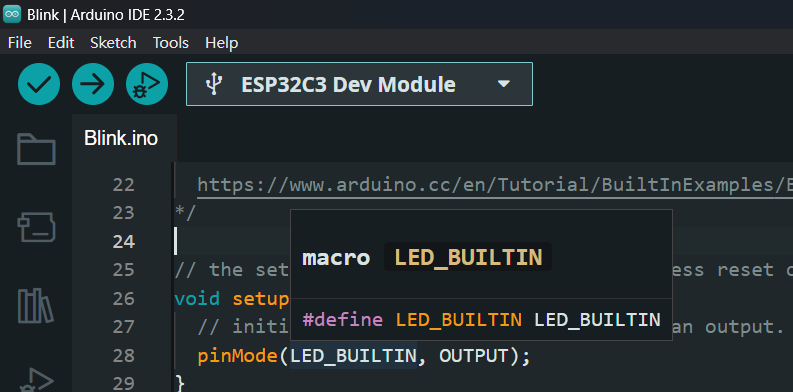
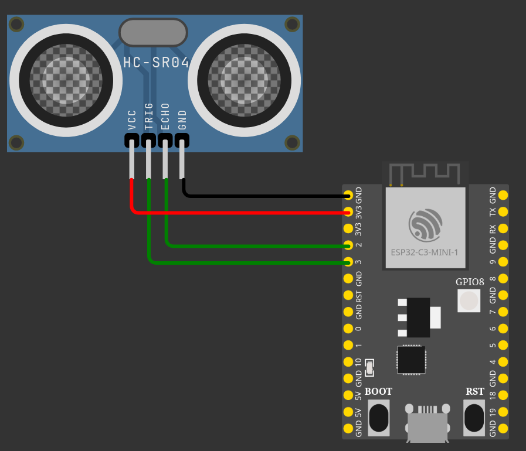
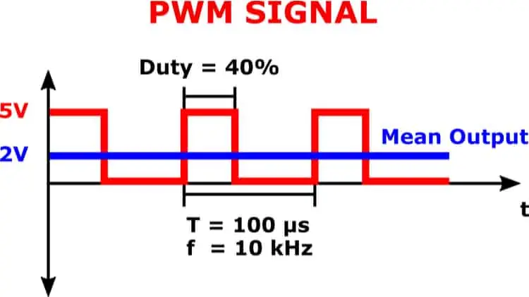
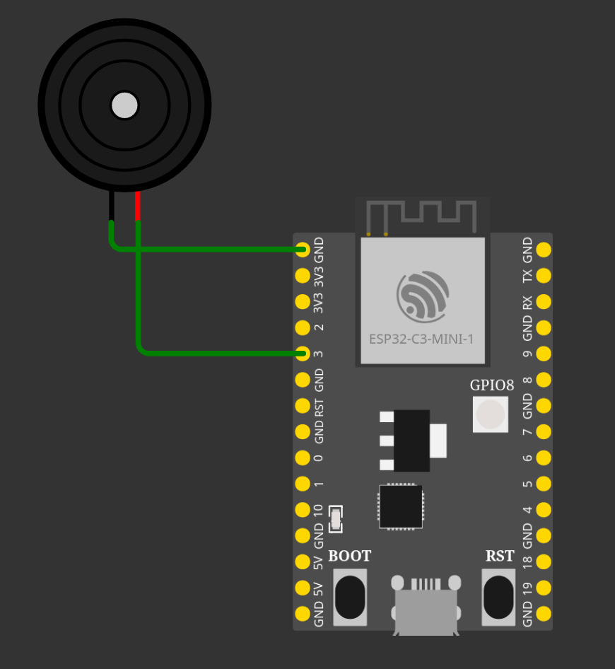
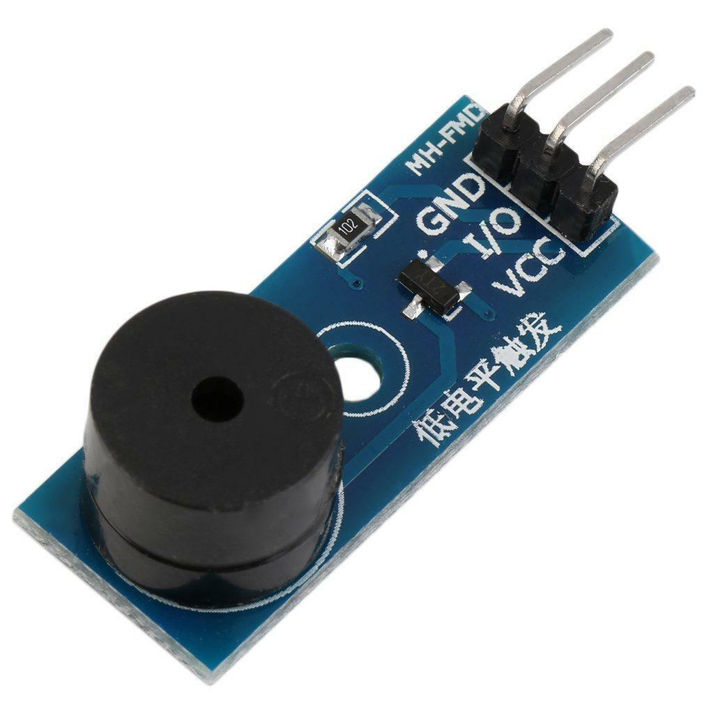
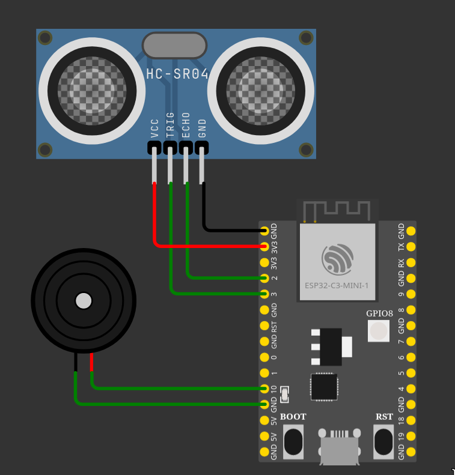
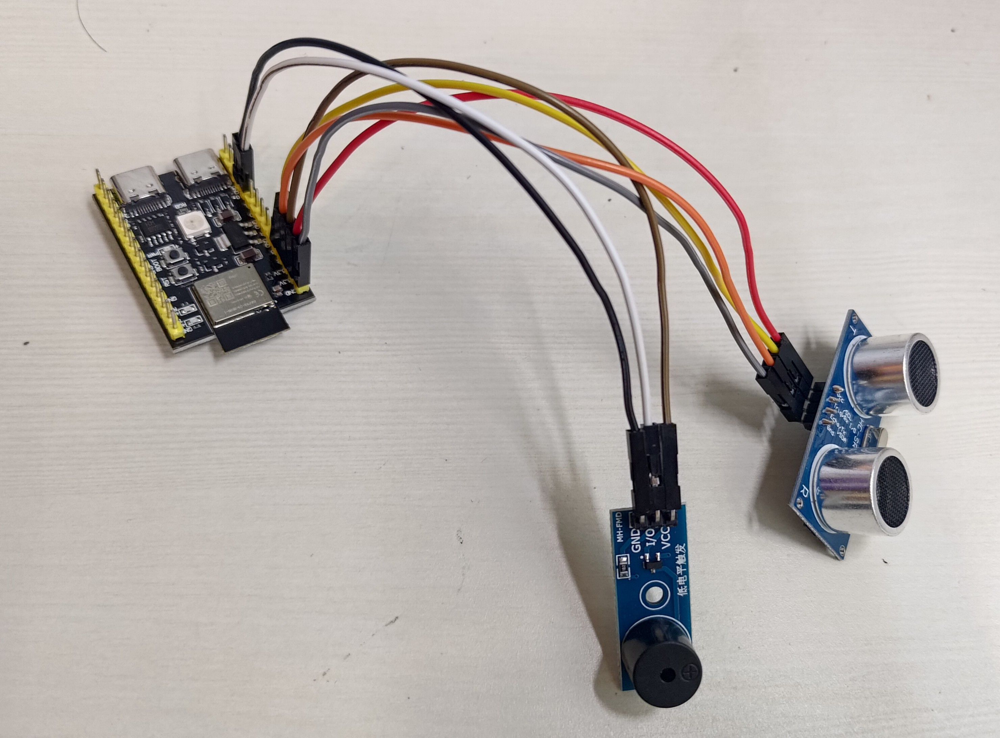

## 前置知識

之前提到，ESP32 有分[很多種系列](https://www.espressif.com/en/products/modules)，
而 ESP32-C3 是 C 系列的其中一個型號。
因為這次用的是 C3，在[上一篇文設定開發版的地方](https://www.tnfshcec.com/post/material/esp32-intro#%E8%AE%93-arduino-ide-%E9%80%A3%E6%8E%A5-esp32)，
開發板類型記得選 `ESP32C3 Dev Module`。

**_你需要先設定好 Arduino IDE 才能繼續往下喔。
看看[上一篇文寫的設定方法](https://www.tnfshcec.com/post/material/esp32-intro#%E9%96%8B%E5%A7%8B%E4%BD%BF%E7%94%A8-esp32)吧。
關於 Arduino 程式的基本運作，也請看看[上一篇文的介紹]()。_**

## 關於我們的 ESP32-C3

官方文檔：https://docs.espressif.com/projects/esp-idf/en/stable/esp32c3/hw-reference/esp32c3/user-guide-devkitm-1.html

_（上面文檔的本子和我們的不大依樣，因為我們的 C3 是雙 USB Type-C 的，但大部分資訊應該沒有差很多）_

這邊我寫幾個有趣的點：

1. 板子上的 LED 是 RGB 的
2. 它支援 WiFi、藍芽
3. 上面有好多電源和接地針腳

## Pinout _（針腳定位）_

來看看我們手上這塊板子的針腳。


可以看到我們有 3V3 (3.3V) 和 5V0 (5V) 但針腳各兩個、還有好幾個接地、剩餘的都是 GPIO ，
也就是我們可以自由運用的輸入 / 輸出針腳。

## Blink，開發板界的你好世界

拿到新板子，還是來 Blink 一下，測試設定有沒有問題、板子能不能正常運作吧。

在「File > Examples > 01.Basics > Blink」，找到 Blink 的範例程式：

```c
/*
  Blink
  ...
*/

// the setup function runs once when you press reset or power the board
void setup() {
  // initialize digital pin LED_BUILTIN as an output.
  pinMode(LED_BUILTIN, OUTPUT);
}

// the loop function runs over and over again forever
void loop() {
  digitalWrite(LED_BUILTIN, HIGH);  // turn the LED on (HIGH is the voltage level)
  delay(1000);                      // wait for a second
  digitalWrite(LED_BUILTIN, LOW);   // turn the LED off by making the voltage LOW
  delay(1000);                      // wait for a second
}

```

這次因為 ESP32C3 Dev Module 已經有定義好 `LED_BUILTIN` 的值，
所以不用再自己 `#define`。



因為 C3 上的 LED 是 RGB 的，所以我們甚至可以指定顏色——打開「File > Examples > ESP32 > GPIO > BlinkRGB」：

```c
/*
  BlinkRGB
  ...
*/
//#define RGB_BRIGHTNESS 64 // Change white brightness (max 255)

// the setup function runs once when you press reset or power the board

void setup() {
  // No need to initialize the RGB LED
}

// the loop function runs over and over again forever
void loop() {
#ifdef RGB_BUILTIN
  digitalWrite(RGB_BUILTIN, HIGH);   // Turn the RGB LED white
  delay(1000);
  digitalWrite(RGB_BUILTIN, LOW);    // Turn the RGB LED off
  delay(1000);

  neopixelWrite(RGB_BUILTIN,RGB_BRIGHTNESS,0,0); // Red
  delay(1000);
  neopixelWrite(RGB_BUILTIN,0,RGB_BRIGHTNESS,0); // Green
  delay(1000);
  neopixelWrite(RGB_BUILTIN,0,0,RGB_BRIGHTNESS); // Blue
  delay(1000);
  neopixelWrite(RGB_BUILTIN,0,0,0); // Off / black
  delay(1000);
#endif
}
```

## 成品：空氣鋼琴

新增專案，我們來做個真正的成品吧。來看看這是什麼：

<iframe width="560" height="315" src="https://www.youtube-nocookie.com/embed/LSBgWfvJT6A?si=DIV7xArhQ7a3WkR1" title="YouTube video player" frameborder="0" allow="accelerometer; autoplay; clipboard-write; encrypted-media; gyroscope; picture-in-picture; web-share" referrerpolicy="strict-origin-when-cross-origin" allowfullscreen></iframe>

它的組成其實很簡單：

1. 距離感測器
2. 發聲器官
3. 一堆 `if` 判斷。

### 超音波測距

參考：https://shop.mirotek.com.tw/iot/esp32-start-10/

簡單來講，給 TRIG pin 一個訊號（10 微秒的 `HIGH`），他就會發射超音播進行測距，
期間 ECHO pin 會給一個訊號代表超音波來回的時間，接著就能在程式裡運用這段時間、計算距離了。

然後有佬幫算完 ECHO pin 的回傳時間除以 `58` 就是**公分**的距離了。

#### 使用範例

_修改自 https://shop.mirotek.com.tw/iot/esp32-start-10/_

接線：


```c
#define TRIG_PIN 3 // 發出觸發訊號腳位
#define ECHO_PIN 2 // 接收測量結果訊號腳位

void setup() {
  pinMode(TRIG_PIN, OUTPUT);
  Serial.begin(9600);
}

void loop() {
  unsigned long d = ping() / 58; // 計算距離
  Serial.print(d);
  Serial.println("cm");
  delay(1000);
}

unsigned long ping() {
  digitalWrite(TRIG_PIN, HIGH); // 啟動超音波
  delayMicroseconds(10);  // 維持 10 微秒的 HIGH 訊號
  digitalWrite(TRIG_PIN, LOW);  // 關閉超音波
  return pulseIn(ECHO_PIN, HIGH); // 計算傳回時間
}
```

### 蜂鳴器

這邊先介紹一些觀念：

1. [PWM](https://zh.wikipedia.org/wiki/%E8%84%88%E8%A1%9D%E5%AF%AC%E5%BA%A6%E8%AA%BF%E8%AE%8A)

   

   PWM 就是像這樣的一高一低的訊號，同時可以控制
   [工作週期（Duty Cycle）](https://zh.wikipedia.org/wiki/%E5%B7%A5%E4%BD%9C%E9%80%B1%E6%9C%9F?oldformat=true)（寬度？）、
   頻率（Frequency），送出不同的資訊。**不過在這邊頻率的調整對我們比較重要。**

2. 音調

   大家都知道，音調的高低是用頻率控制的。

   [Google 一下](https://www.google.com/search?q=note+frequency)，我們就找得到各音階的頻率了。

#### 發送訊號

接線：

我們可以用 Arduino 內建的 [`tone()`](https://www.arduino.cc/reference/en/language/functions/advanced-io/tone/) 函式，直接控制發出 PWM 訊號。

```c
tone(PIN, 262);
tone(PIN, 262, 200);
// tone(PIN, FREQUENCY [, DURATION(ms)])
// tone(針腳, 頻率 [, 時間（毫秒）])

noTone(PIN);
// 停止 `tone()` 函式開始的訊號。
// 因為 `tone()` 函式呼叫後會在程式運行的同時持續發送訊號，
// 如果你沒有指定時間（DURATION），你就需要 `noTone()` 停止這個訊號。
```

當然，還有其他送出 PWM 訊號的方法（`tone()` 完全就是為了發出聲音才存在的啊），
像是 `analogWrite()`（只能改變工作週期）、`ledc` 等。

#### 停止聲音

剛剛講了 `noTone()` 可以讓 `tone()` 的訊號停止，不過你可能會發現，
呼叫了 `tone()` 之後蜂鳴器的聲音還是繼續在播放，為什麼呢？

仔細看到 MH-FMD 板子上：



可以看到**「低電平觸發」**的字樣。
所以，在訊號停止後，蜂鳴器收到的 `LOW` 訊號（0 伏特，也就是沒有訊號）反而會讓它繼續發聲！

既然如此，那我們就用 `HIGH` 訊號讓他停止：

```c
digitalWrite(PIN, HIGH);
```

> [!NOTE]
> 雖然這會讓蜂鳴器停止，但如果你沒有先呼叫 `noTone()`，
> `tone()` 的訊號可能還是會持續發送直到指定的時間。

### 組合你的零件

我們的目標是讓距離在不同地方時發出的聲音不同，所以只要把剛剛兩個零件結合，
搭配程式碼，就可以完成啦！

先把兩個零件都接上：


再來想想：

既然我們的目標是**在不同的感測距離，讓蜂鳴器發出不同聲音**，
那麼我們就修改既有的距離感測的程式，讓它在不同的距離下發送不同的訊號不就行了？

```c
#define TRIG_PIN 3 // 發出觸發訊號腳位
#define ECHO_PIN 2 // 接收測量結果訊號腳位
#define BUZZER_PIN 10 // 發出蜂鳴器訊號的腳位

void setup() {
  pinMode(TRIG_PIN, OUTPUT);
  pinMode(BUZZER_PIN, OUTPUT);
  Serial.begin(9600);
}

void loop() {
  unsigned long d = ping() / 58; // 計算距離
  Serial.print(d);
  Serial.println("cm");
  delay(200);

  if (d <= 5) { // 小於等於 5 公分
    tone(BUZZER_PIN, 262); // 262 Hz 是中央 Do
  } else if (d <= 10) {
    tone(BUZZER_PIN, 294);
  } else if (d <= 15) {
    tone(BUZZER_PIN, 330);
  } else {
    noTone(BUZZER_PIN);
    // digitalWrite(BUZZER_PIN, HIGH);
  }
}

unsigned long ping() {
  digitalWrite(TRIG_PIN, HIGH); // 啟動超音波
  delayMicroseconds(10);  // 維持 10 微秒的 HIGH 訊號
  digitalWrite(TRIG_PIN, LOW);  // 關閉超音波
  return pulseIn(ECHO_PIN, HIGH); // 計算傳回時間
}
```

> [!IMPORTANT]
> 如果你用的是 MH-FMD 板子，因為「低電平觸發」的關係，
> 你需要在 `noTone()` 之後再加 `digitalWrite(PIN, HIGH)` 讓它停止！

當然，這邊只會在 5 公分內、10 公分內、15 公分內分別發出中央 Do、Re、Mi 的音，
剩下的音就讓你們自由發揮了！


