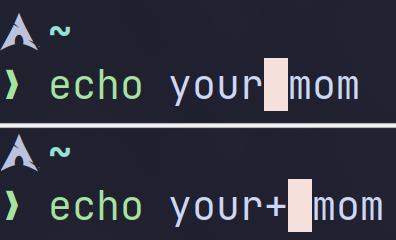

原本搞 CTF 就沒想要再寫，結果我還是來了

## 前置知識

### 終端機（Terminal）的使用

在這篇裡面大多會使用到 Terminal 的工具，
有鑑於有些人可能沒有碰過，這邊稍微解釋一下

1. 游標與文字輸入

通常 Terminal 裡的游標不會是一條線，而是與文字等寬的方塊，且不會閃爍標示位置。

那這樣要怎麼輸入文字呢？
很簡單，跟平常一樣就好。至於輸入的位置，就在**游標那個方格的位置**。



2. 輸入密碼

因為安全性的設計，Terminal 輸入密碼是看不到的。打了字沒有反應是正常的。

### Linux 與 Unix

_等一下，不想上歷史課_

簡單來講，[UNIX](https://zh.wikipedia.org/wiki/UNIX) 是一種*古早*的作業系統，
而 [Linux](https://zh.wikipedia.org/wiki/Linux) 是屬於 [Unix-like (\*NIX)](https://zh.wikipedia.org/wiki/%E7%B1%BBUnix%E7%B3%BB%E7%BB%9F) 的系統，也就是說它**類似** Unix 系統的運作方式、邏輯。

蘋果的 MacOS 屬於 Unix 系統，
和 \*NIX 系統都大致遵守 [POSIX](https://zh.wikipedia.org/wiki/%E5%8F%AF%E7%A7%BB%E6%A4%8D%E6%93%8D%E4%BD%9C%E7%B3%BB%E7%BB%9F%E6%8E%A5%E5%8F%A3) 規範，
所以這邊講的東西在 403 電腦上大部分應該都通。

## 指令行（Command Line）

Command Line 就是你平常打指令的地方，打完指令 <kbd>Enter</kbd> 送出就好啦

### `echo`

`echo` 就是最基本的指令啦，就是 Python 的 `print()`、JS 的 `console.log()`、C 的 `printf()`、C# 的 `Console.WriteLine()`。

試試看 Hello World：

```sh nonumbers
echo Hello World
```

### 一些快捷鍵

1. <kbd>↑</kbd>（向上鍵）：重新輸入上一個指令。

2. <kbd>Ctrl-C</kbd>：終止目前運行的指令。

> [!IMPORTANT]
> 因為 <kbd>Ctrl-C</kbd> 會終止軟體運行，
> 進行**複製**的時候請用 <kbd>Ctrl-Shift-C</kbd>。

3. Ctrl-D ：輸入[傳輸結束字符](https://zh.wikipedia.org/zh-tw/%E4%BC%A0%E8%BE%93%E7%BB%93%E6%9D%9F%E5%AD%97%E7%AC%A6)。
   通常會告訴運行軟體終止輸入、停止運作，在空 Terminal 使用會直接登出。

## 目前的資料夾（Current Directory）

指令的使用都會在一個資料夾中進行，這就會是指令運行的基準點。

### `pwd`

`pwd` (print working directory) 會顯示目前資料夾的位置。

通常在登入過後，目前的資料夾會預設到**用戶的個人資料夾**（home directory），
路徑應該長這樣：`/home/<user>`

### `ls`

`ls` (list) 會列出目前資料夾中的所有檔案。

幾個實用 flag：

1. `-a`：連同隱藏的檔案（名字前面加一個 `.` 的）也顯示出來。
2. `-l`：以條列方式顯示，也會顯示[檔案權限](#檔案權限permission)、擁有者等資訊。

### `cd`

`cd` (change directory) 可以更變目前的資料夾，也就是移動 Terminal 運作的位置。

## 路徑（Path）

檔案總是會放在不同的資料夾裡，所以需要路徑指定檔案的位置。
就像每間房子的地址。

> [!NOTE]
> Unix 與 \*nix 系統沒有像 Windows 有 C 槽、D 槽，東西全部都在**根目錄**（root folder）之下。  
> 也就是說，`/` 就是一個路徑的起點。

1. 絕對路徑（Absolute Path）：從**根目錄**開始指定的路徑。例如：`/bin`、`/usr/bin/echo`、`/home/<user>/Documents/file`
2. 相對路徑（Relative Path）：由**目前的位置**開始指定的路徑。例如：`file`、`./file`、`../file`

   當目前資料夾為 `/home/user`，相對路徑 `file` 或 `./file` 就會指定 `/home/user/file`。
   而 `..` 指定的是**上一個資料夾**，所以在這個情況下 `../file` 會指定 `/home/file`。

<!-- TODO: below this -->

## 一些實用指令

<!-- file, grep, cat, tee, touch, tar (unzip, unrar) -->

## 執行檔（Executable）

## 檔案權限（Permission）
