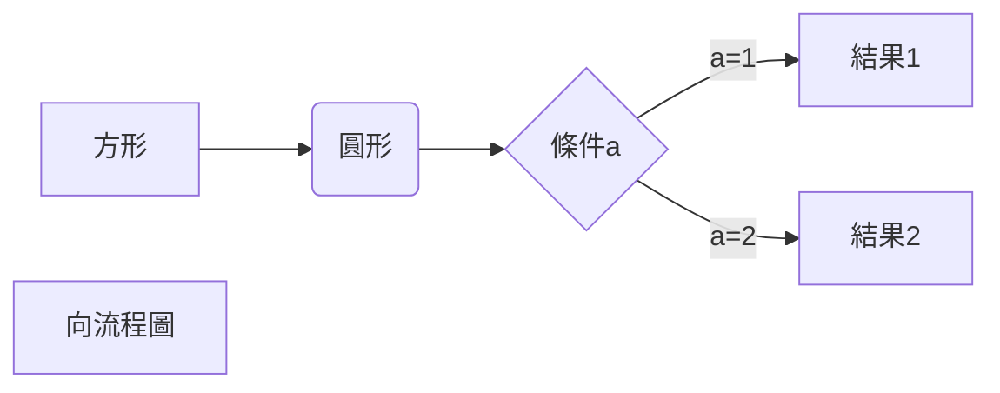
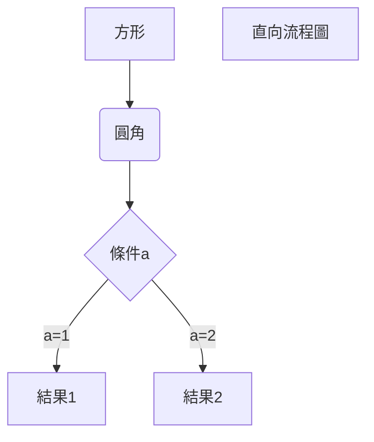
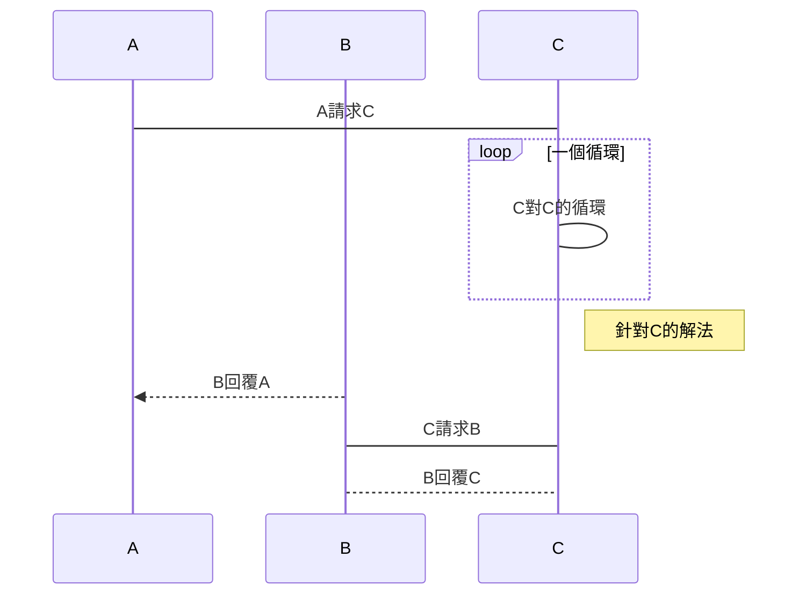
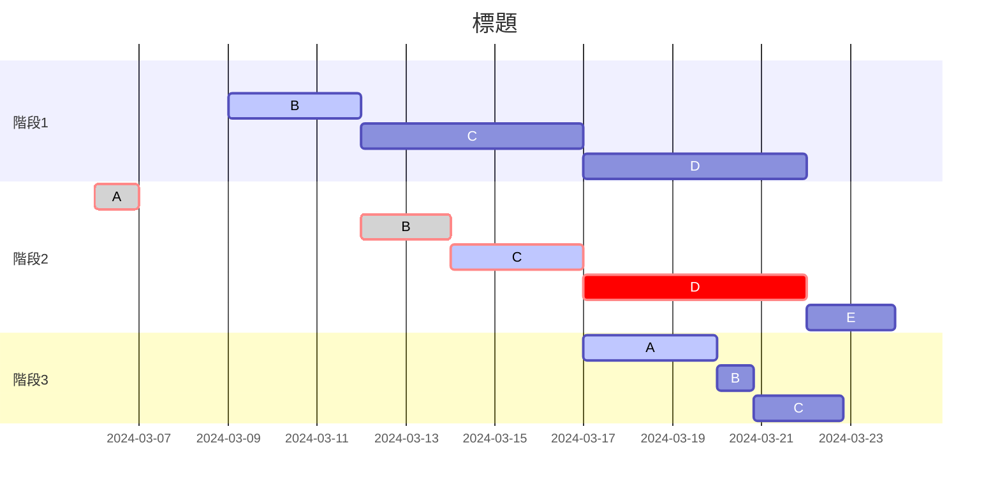

<script>
  import atarayo from "./image/atarayo.png"
  import atarayo2 from "./image/atarayo2.png"
  import block from "./image/block.png"
  import boss1 from "./image/boss1.png"
  import boss2 from "./image/boss2.png"
  import boss3 from "./image/boss3.png"
  import boss4 from "./image/boss4.png"
  import boss5 from "./image/boss5.png"
  import boss6 from "./image/boss6.png"
  import boss7 from "./image/boss7.png"
  import boss8 from "./image/boss8.png"
  import codeblock_tab from "./image/codeblock_tab.png"
  import codeblock from "./image/codeblock.png"
  import conflict from "./image/conflict.png"
  import dc from "./image/DC.png"
  import footnote from "./image/footnote.png"
  import happy from "./image/happy.png"
  import key from "./image/key.png"
  import line from "./image/line.png"
  import list from "./image/list.png"
  import listinlist from "./image/listinlist.png"
  import math from "./image/math.png"
  import pic from "./image/pic.png"
  import table from "./image/table.png"
  import table2 from "./image/table2.png"
  import taowa from "./image/taowa.png"
  import titles from "./image/title.png"
  import todo from "./image/todo.png"
</script> 

> 放下Word，立地成材

## Markdown是什麼?
馬克大奧，一種非常輕的標記語言，與一般程式語言不同的是，他的重點在於直接的"表達"，非常快速的寫出和讀出文檔。
> [!TIP] Markdown誕生的目的是**易寫**和**易讀**，所以如果沒有特殊需求的話讓他越好讀越好
甚至在 [Discord](https://discord.com/) 的聊天室中可以直接使用，功能媲美其他筆記軟體。
使用Markdown寫出來的文檔可以非常簡單的導出成`docx`、`html`、`html` 甚至是電子閱讀器使用的 `epub`。


▲ 在Discord中使用Markdown


## Markdown，啟動!
理所當然的，Markdown的後綴是 **_.md_**。
許多網站都支援Markdown，為求方便，這次使用即時預覽 `typora` 作介紹。

> [!TIP] 私心推薦Markdown的寫作平台
> - StackEdit - ⭐⭐⭐⭐，免費，Chrome應用程式，線上同步
> - Notion - ⭐⭐⭐⭐，部分免費，算有名的筆記軟體
> - dillinger - ⭐⭐⭐⭐，跟`StackEdit`差不多，同步方式更多
> - AppFlowy - ⭐⭐⭐⭐，開源免費，多平台
> - typora - ⭐⭐⭐，收費，多平台
> - obsidian - ⭐⭐⭐，部分免費，多平台
> - VSCode - ⭐⭐，免費，要裝插件才勉強能用
> 
> 有點用的書: [了不起的Markdown](https://www.books.com.tw/products/CN11667983)

### 1. Markdown 的標題

Markdown 共有**六級**標題，`#` 的數量即代表1~6級標題，例如:
```markdown
# 一級標題
## 二級標題
### 三級標題
#### 四級標題
##### 五級標題
###### 六級標題
```
顯示的效果就是:


> [!NOTE] 
> 在 `#` 以後務必要加空白鍵，否則無法正常顯示  
> 另外在打 `--` 及 `==` 時會將上方文字分別自動調整為1級及2級標題，部分軟體及網站不支援不建議使用  
> 額外補充，大部分時候3~4級就已經跟一般文字大小差不多了，建議做為小標

### 2. Markdown 的段落
一開始使用Markdown時我也有這樣的疑惑，到底怎樣才算"換行"  
在Markdown裡換行有兩種方式，第一種是在**文字尾端加上兩個空白鍵**  
第二種是直接換兩行開啟新段落，例如:


#### 2.1 Markdown 的字體
跟Word一樣，Markdown可以使用以下語法改變字體樣式:
```markdown
*斜體*
_斜體_
**粗體**
__粗體__
***粗斜體***
___粗斜體___
```

### 3. Markdown 的列表
Markdown有**有序列表**和**無序列表**

#### 3.1 有序列表
**有序列表**用數字加上 `.` 來使用，例如:
```markdown
1. 第一項
2. 第二項
3. 第三項
```
顯示結果同上，不額外展示
> [!NOTE] 
> 無論有序還是無序，請務必在標點後加上空白鍵!  
> 有序列表大部分時候只支援數字，使用 `I` 或 `甲` 之類其他計算方式是不行的喔

#### 3.2 無序列表
**無序列表**用 `*` 、 `+` 或 `-` 來使用，例如:
```markdown
* 第一項
+ 第二項
- 第三項
```
就會顯示:


無序列表還有一種待辦清單的型態，例如:
```markdown
- [x] 喜歡玩遊戲
- [x] 喜歡陪兄弟玩遊戲
- [ ] 喜歡兄弟
```
顯示:


#### 3.3 子列表
在列表底下接上子列表，只需要在選項前面加上**2**或**4**個空格就好，例如:
```markdown
1. 第一項
  - 第一款
  2. 第二款
- 第一項
    1. 第一款
    + 第二款  
```
顯示的結果為:


### 4. Markdown 的區塊引言
區塊引言這部分跟列表的邏輯其實大同小異，這邊直接舉個例子:
```markdown
> 區塊
```
在 `>` 後面加上`空白鍵`再加上自己要的文字，就可以做到這樣的效果:


如果想要在區塊引言裡面使用區塊引言、在區塊引言中使用列表或是在列表中使用區塊引言，邏輯上其實都差不多，例如:
```markdown
> 區塊引言
> > 裡面的區塊引言
> > > 再裡面的區塊引言

> 區塊
> 1. 裡面的有序列表
> - 裡面的無序列表

1. 有序列表
> 裡面的區塊引言
2. 有序列表
```
結果如下:


> [!NOTE] 這裡唯一需要注意的只有區塊後面無論如何**一定要加空白鍵**，沒有 `>>>` 這種使用方式

### 5. Markdown 的程式碼
當你有程式碼想要在句子裡顯示的時候，可以使用反引號把他框起來，例如:
```markdown
誰平常會用 `and` 代替 `&&` 啊?
```
就會顯示:


但當我們有一大串code想要寫的時候怎辦呢? 這時候有兩種辦法
1. 使用**4個空白鍵**或是**1個tab**
    ```markdown
      int main()
      {
        cout << "Hello, C++!" << endl;
        return 0;
      }
    ```
    效果:
    

2. 使用 ``` 把程式碼包起來
   ````markdown
   ```
    int main()
    {   
    cout << "Hello, C++!" << endl;
    return 0;
    }
   ```
   ````

  效果:
  

  > [!NOTE] 如果希望區塊裡的程式碼可以區分顏色的話，可以在第一行的```後面加上程式語言的名稱，顏色就會自己加上了 (有些軟體不支援)

### 6. Markdown 的連結
要在Markdown裡面讓文字變成超連結也有兩種方式:
```markdown
[連結的說明](連結)

or 

<連結>
```
例如:
```markdown
天啊[あたらよ](https://www.youtube.com/channel/UCgrtbLQsox2EYtF0iVclZjA)的歌實在太好聽了，我要分享給大家:
<https://www.youtube.com/watch?v=8L5cQlXMpeY>
```
看起來就會像:


還有一種進階用法，把變量賦值在其他地方，例如:
```markdown
聽說[あたらよ][1]是114級社長的本命團欸，
他最喜歡[「僕は...」][2]和[10月無口な君を忘れる][3]了
我這樣打了一堆字之後，
在底下放個連結也可以連上喔:D

[1]: https://www.youtube.com/channel/UCgrtbLQsox2EYtF0iVclZjA
[2]: https://www.youtube.com/watch?v=8L5cQlXMpeY
[3]: https://www.youtube.com/watch?v=zO8yNYEsYTc
```
效果:


### 7. Markdown 的圖片
上面傳了那麼多圖片，終於講到圖片了
大致上的格式長這樣:
```markdown

```
標題事實上可有可無，只會影響使用者將圖標放上去之後會不會顯示文字還有盲人聽不聽得到  
實例如下:
```markdown
開心嗎?

```
效果:


當然，圖片那個類似賦值的方式也可以使用喔:
```markdown
聽說[あたらよ][1]是114級社長的本命團欸，
他最喜歡[「僕は...」][2]和[10月無口な君を忘れる][3]了
我這樣打了一堆字之後，
在底下放個連結也可以連上喔:D
[atarayo][4]

[1]: https://www.youtube.com/channel/UCgrtbLQsox2EYtF0iVclZjA
[2]: https://www.youtube.com/watch?v=8L5cQlXMpeY
[3]: https://www.youtube.com/watch?v=zO8yNYEsYTc
[4]: https://i.ytimg.com/vi/8L5cQlXMpeY/maxresdefault.jpg
```
效果:


> [!NOTE] 
> Markdown的圖片有個致命傷: 不能調整大小  
> 這時候就先折衷一下吧，用普通的img標籤:
> ```
> 
> ```

### 8. Markdown 的表格
哈哈，是不是越看越頭疼，接下來更頭疼的要來了  
這大概是整個Markdown除了數學以外的部分最令人詬病的地方: 勾使一樣的表格系統  
先來個範例:
```markdown
| 表頭 | 表頭 |
| ---- | ---- |
| 格子 | 格子 |
| 格子 | 格子 |
```
顯示結果:


> [!TIP] 
> 這部分手寫真的會非常噁心，而且很容易寫到不知道自己在寫什麼，所以狀況許可下還是使用網路上的產生器或是VScode的插件較佳

> [!NOTE] 用 `:` 可以讓表格裡的文字靠某一邊對齊，例如:
> ```markdown
> | 左對齊 | 右對齊 | 居中對齊 |
> | :-----| ----: | :----: |
> | 格子 | 格子 | 格子 |
> | 格子 | 格子 | 格子 |
> ```
> 顯示結果:
> 

#### 9 支援HTML
如果你比較細心一點，應該可以看到上面的Note有寫到可以使用img標籤，這是因為Markdown有支援HTML  
大部分在Markdown範圍外的文字編輯都可以靠HTML做到，支援的有:  
`<kbd>` `<b>` `<i>` `<em>` `<sup>` `<sub>` `<br>`  
例如:
```markdown
使用 <kbd>ale</kbd>+<kbd>F4</kbd> 啟動遊戲加速
```
顯示:


### 10. Markdown 的你可能不會想用的非核心功能
合先敘明，以下功能大多為**非常用**功能或是**不一定通用**的功能，如果遇到了恭喜你就只能用，但請在心中默念三次
> 不要遇到 不要遇到 不要遇到

#### 10.1 註腳
在寫小論文的時候常常會需要像Wikipedia那樣有個註腳，可以這樣實現:
```markdown
寫文章需要
一個註釋[^1]
兩個註釋[^也可以直接寫進這裡]

[^1] 註釋欸
```
實際看起來:


#### 10.2 跳轉
讓你可以跳到其他章節，例如:
```markdown
[跳轉](#1-markdown-的標題)
```
就會顯示一個叫[跳轉](#1-markdown-的標題)的超連結，讓你跳到想要的章節

#### 10.3 衝突解決
Markdown佔用了很多字符，所以如果有特別想顯示被占用的字符 (例如 `*` 之類的) ，  
就可以在前面加反斜線來顯示
```markdown
**加粗**
\*\*顯示星號\*\*
```
實際顯示:


#### 10.5 公式
> Markdown沒有寫不出來的格式，只看在你能承受多少

背後的運作原理比較複雜，有需要再來問我們:D  
大部分的情況下都可以直接看[KaTeX的支援列表](https://katex.org/docs/supported.html)來使用  
這邊炫個技，剩下各位自己琢墨
```markdown
$$
        \begin{pmatrix}
        1 & a_1 & a_1^2 & \cdots & a_1^n \\
        1 & a_2 & a_2^2 & \cdots & a_2^n \\
        \vdots & \vdots & \vdots & \ddots & \vdots \\
        1 & a_m & a_m^2 & \cdots & a_m^n \\
        \end{pmatrix}
$$

$$
\begin{array}{cc}
\mathrm{Bad} & \mathrm{Better} \\
\hline \\
e^{i\frac{\pi}2} \quad e^{\frac{i\pi}2}& e^{i\pi/2} \\
\int_{-\frac\pi2}^\frac\pi2 \sin x\,dx & \int_{-\pi/2}^{\pi/2}\sin x\,dx \\
\end{array}
$$
```
顯示: 


太噁心啦😍😍😍😍

#### 10.6 大魔王 - 流程圖、順序圖、甘特圖
還好沒有註釋，所以底下這邊就任我放:D  
以下分別是[流程圖](#962-直向流程圖)、[順序圖](#965-uml順序圖)及[甘特圖](#968-甘特圖)的樣板
#####9.6.1 橫向流程圖
````markdown

````


##### 9.6.2 直向流程圖
````markdown

````


##### 9.6.3 標準流程圖(橫)
````markdown
```flow
st=>start: 開始
op=>operation: 處理
cond=>condition: 判斷
sub1=>subroutine: 小流程
io=>inputoutput: 輸入輸出
e=>end: 結束
st(right)->op(right)->cond
cond(yes)->io(bottom)->e
cond(no)->sub1(right)->op
```
````


##### 9.6.4 標準流程圖(直)
````markdown
```flow
st=>start: 開始
op=>operation: 處理
cond=>condition: 判斷
sub1=>subroutine: 小流程
io=>inputoutput: 輸入輸出
e=>end: 結束
st->op->cond
cond(yes)->io->e
cond(no)->sub1(right)->op
```
````


##### 9.6.5 UML順序圖
````markdown
```sequence
A->B: 請求
Note right of B: B描述
Note left of A: A描述
B-->A: 回應
A->B: 再回應
```
````


##### 9.6.6 UML順序圖(複雜版)
````markdown
```sequence
Title: 標題
A->B: A對B請求
Note right of B: B描述
Note left of A: A描述
B-->A: B對A回覆
B->C: B對C請求
C-->>A: C對A請求
A->B: A對B請求？
Note over C,B: 共識
participant C
Note right of C: C描述
```
````


##### 9.6.7 UML標準順序圖
````markdown

````


##### 9.6.8 甘特圖
````markdown

````


## 總結
以上是入門Markdown的所有內容! 如果需要額外的補充歡迎再隨時問!
補充連結:   
[Maxkit - 如何在 Markdown 輸入數學公式及符號](https://blog.maxkit.com.tw/2020/02/markdown.html)  
[8分鐘讓你快速掌握Markdown](https://www.bilibili.com/video/BV1JA411h7Gw/?spm_id_from=333.337.search-card.all.click&vd_source=886ccfcc8bb350cf9b5294a1d20aca71)  
[[Markdown + Typora/VSCode 超全教程] 给大一新生安利的文本神器 !](https://www.bilibili.com/video/BV1hG411p7fX/?spm_id_from=333.788.recommend_more_video.-1&vd_source=886ccfcc8bb350cf9b5294a1d20aca71)  
[BEYOND【海闊天空】Music Video (粵) (HD)](https://youtu.be/qu_FSptjRic?si=57-bRU6VLio_uzTz)
[Obsidian - Sharpen your thinking](https://obsidian.md/)
[Appflowy - Github](https://github.com/AppFlowy-IO/AppFlowy)
