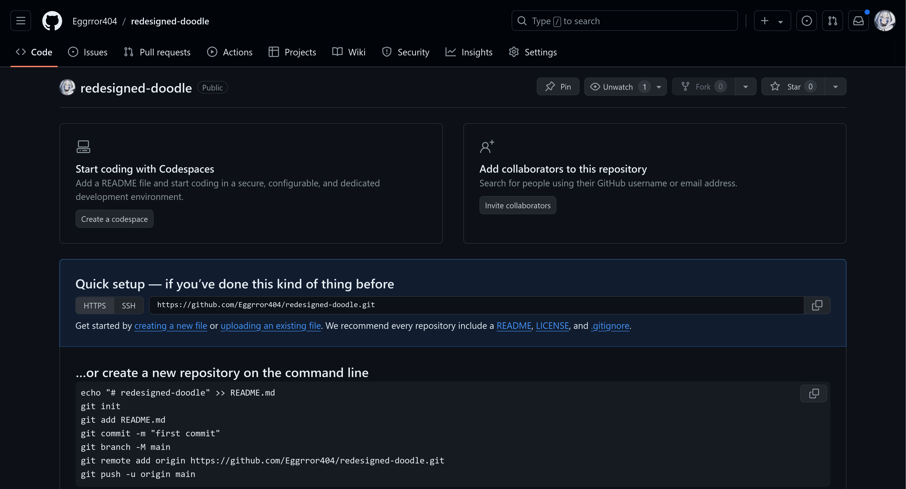
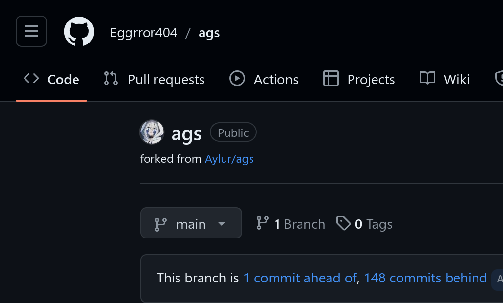

> 據說 PalWorld 在開發初期還不知道有 git 這東西，
> 他們每個禮拜都會買一大疊隨身碟來做備份...

## 版本控制

就像 Google 文件的自動儲存，每做一點更動就建立存檔點，
這樣就不怕改了什麼回不去、或什麼搞壞了就回得到上個存檔...

_核心概念其實就是這樣，
好奇你各位再自己去看[維基百科](https://zh.wikipedia.org/zh-tw/%E7%89%88%E6%9C%AC%E6%8E%A7%E5%88%B6)_

## 版本控制軟體

從以前到現在也出現了不少軟體提供了這個功能：

- **Subversion**
- **Git**
- **Mercurial**
- _還有其他非常多種！_

### Git

現在最多人用、最普及的軟體就是 Git。
它功能有很多，但其實大部分情況你會用到的就是那些常用的，以下我們就會依序介紹。

_順帶一提，他是在 Linux 開發期間為了改善版本控制軟體誕生的 🛐_

### Git 託管平台（Git Hosting Platform）

Git 可以透過架設一個遠程（Remote）的伺服器，同步多個裝置上的內容。

以我們社團而言，我們就需要這麼一個伺服器才能讓大家同步進度。

> [!NOTE]
> 關於託管平台與遠端，[下面](#remote遠程主機)有更詳細的介紹。
> 現在我們先點到為止。

Git 的生態已經發展得非常蓬勃，我們不需要自己架設伺服器，
已經有很多容易使用的平台可以幫你管理、儲存內容。

1. [GitHub](https://github.com/)

   目前市面上最大的 Git 託管平台。

   _目前微軟收購，也就是說，你逃不過比爾蓋茲的魔掌。_

2. [GitLab](https://about.gitlab.com/)

   目前 GitHub 佔了這個市場的大半，但 GitLab 就是我們第二個選項了。
   GitLab 除了直接使用官方的平台還可以自架（Self-host），
   本身也大部分開源，或許會是開源軟體開發團隊的好選擇。

3. [Bitbucket](https://bitbucket.org/)、[Gitea](https://about.gitea.com/) 及 [Gitee](https://gitee.com/) 等其他平台

   當然，在一個開放的市場裡，我們還有很多種選擇，就看各位喜歡哪個了。

### GitHub

因為我們最常使用的大概還是 GitHub，這邊稍微介紹一下 GitHub 整體平台。

我們在 GitHub 上有 [tnfshcec](https://github.com/tnfshcec) 這個組織，可以給你各位社員加入。
同時上面也有[這個網站的原始碼](https://github.com/tnfshcec/tnfshcec-web)、和我們一些奇奇怪怪的項目。

除了 Git 託管，它基本上就是一個社群平台。
你可以追蹤人、追蹤項目、對項目按星星（喜歡），
這個教材上不會一張圖一張圖做功能介紹，還請各位自己摸索看看吧。


#### 建立 repo 空間

要使用託管平台，那我們就要知道如何上傳我們的內容。
如何設定、上傳，會在[下面](#remote遠程主機)一併說明，
但這邊我們先來建立一個 repo 空間：

1. 登入（或註冊）GitHub，按下首頁左邊有一個「New」按鈕，就可以了。
2. 你需要輸入一些基本資料，最主要就是 **repo 名稱** 和 **是否公開**，相信各位可以自行決定。
   其他選項就先暫時略過。
3. 最後按「Create Repository」後，就完成了。



#### 在本機上登入 GitHub

為了上傳內容上 GitHub，我們總是要先確認我們就是帳號的擁有者。
所以需要先在本機上先登入，留下資訊。

參考官方文檔：[Authenticating with GitHub from Git](https://docs.github.com/en/get-started/getting-started-with-git/set-up-git#authenticating-with-github-from-git)

最簡單的方式，是使用 [GitHub CLI](https://docs.github.com/en/github-cli/github-cli/about-github-cli)。
使用 `gh auth login` 指令就可以跟著畫面上的指示走了：

```sh
gh auth login
# ? What account do you want to log into? GitHub.com
# ? What is your preferred protocol for Git operations on this host? HTTPS
# ? How would you like to authenticate GitHub CLI? Login with a web browser
#
# ! First copy your one-time code: E48C-D9A5
# Press Enter to open github.com in your browser...
#
# ✓ Authentication complete.
# - gh config set -h github.com git_protocol https
# ✓ Configured git protocol
# ! Authentication credentials saved in plain text
# ✓ Logged in as YOUR_MOM
```

## 接下來要使用的工具

下面我們會用到 Git 並在終端機打指令。

請先下載 Git：<https://git-scm.com/>

然後就可以接著到 [概念與專有名詞](#概念與專有名詞) 了。

### 圖形界面（GUI）

**_圖形界面是給弱者的，相信電機社社員都不需要用到_**

但是方便起見，這裡列幾個你可能會想看看的軟體：

1. VSCode 內建的 Git 界面：其實 VSCode 內建的已經夠好了，你也可以裝裝看 [GitLens](https://marketplace.visualstudio.com/items?itemName=eamodio.gitlens) 插件。
2. [GitHub Desktop](https://github.com/apps/desktop)：GitHub 官方的 App。按幾個按鈕就可以和 GitHub 溝通。
3. [Sourcetree](https://www.sourcetreeapp.com/)：Git 的圖形化用戶端。
4. [lazygit](https://github.com/jesseduffield/lazygit): 在 terminal 中的圖形化界面（TUI）。推薦給喜歡用 terminal 但懶得記進階 Git 指令的人。

## 概念與專有名詞

以下我們會介紹一些概念以及 Git 指令。

如果各位沒碰過 terminal 終端機，可以參考我們的 [\[教材\] Linux / Unix 實用概念介紹](/post/material/linux-intro)。

> [!NOTE]
> Commit 的時候 Git 需要用你的用戶資料進行處理，
> 他可能會跳出這些訊息：
>
> ```txt nonumbers
> Author identity unknown
>
> *** Please tell me who you are.
>
> Run
>
>   git config --global user.email "you@example.com"
>   git config --global user.name "Your Name"
>
> to set your account's default identity.
> Omit --global to set the identity only in this repository.
> ```
>
> 那麼就照他說的，設定好用戶名以及郵件就好了：
>
> ```sh
> git config --global user.email "you@example.com"
> git config --global user.name "Your Name"
> ```

### Repository (Repo)

儲存庫 / 倉庫。就是整個項目的目錄。

在 Git，使用 `init` 指令可以初始化（initialize）一個 repo，
也就是創建一個 repo 的意思。

```sh
git init [資料夾]
```

如此就會在 _[資料夾]_ 的地方創建一個新的 repo。
不指定資料夾就會在目前的資料夾創建。

### Status（狀態）

一個 repo 可能會有好幾種狀態：沒有變更、有變更過、準備新增變更等。
使用 `status` 指令即可看到目前的狀態。

```sh
git status
```

```txt nonumbers
# 空 repo 的狀態
On branch master

No commits yet

nothing to commit (create/copy files and use "git add" to track)
```

### Add（新增）

做了改動後，在準備紀錄下這個版本前，我們需要先講好這個版本裡要加入什麼東西。

`add` 指令就可以加入你指定的檔案或者資料夾離開 `Untracted`，也就是未追蹤的狀態。

```sh
git add [檔案/資料夾]
```

指定資料夾的意思是讓資料夾內的所有檔案都加入，所以如果你想要一次加入所有檔案，
使用 `.`（目前的資料夾）作為新增的目標就好了。

```sh
# 新增目前資料夾的所有檔案
# 如果你在 repo 的根目錄，就會新增所有更動！
git add .
```

在新增完檔案後，你應該會看到類似的狀態（用 `status` 指令看！）：

```txt nonumbers
On branch master

No commits yet

Changes to be committed:
  (use "git rm --cached <file>..." to unstage)
        new file:   mom.txt
```

他就準備好可以 commit 了。

### Commit

你建立的每一個版本，叫做一個 Commit。
一個個 Commit 接起來，可以叫它 Commit Log。_（log：紀錄，不是木材）_

`commit` 指令會帶著目前新增的更動，為目前的 repo 新增一個 commit。

```sh
git commit -m "訊息"
```

> [!IMPORTANT] **Commit 訊息要寫什麼**
>
> _通常寫程式頭痛的不是程式不會寫，是 commit message 不會寫。_
>
> 這邊有幾點給你參考看看：
>
> - 好好描述這個 commit 包含了哪些更動、什麼樣的更動、為什麼要做這些更動。  
>   例如：「add "your mom" into the project due to popular demand」（舉例而已）
> - 如果有需要，我們有一個 commit 訊息的標準格式，
>   詳細內容在[這邊](https://www.conventionalcommits.org/zh-hant/v1.0.0/)（[英文](https://www.conventionalcommits.org/en/v1.0.0/)）  
>   例如：「feat: add "your mom" into the project」（注意前綴，不同前綴有不同意思）
> - 一句話說明不完的，可以在後面幾行進行更詳細的說明。例如：
>
>   ```git-commit nonumbers
>   add "your mom" into the project
>
>   This was made because of issue #69 and popular demand from the community,
>   and includes most features that was requested.
>
>   The implementation was done with function `yourMom()`
>   and calling life support for the maintainer.
>   Please be careful on seeing the actual code, because statistically there is
>   a 99% chance for it to cause a heart attack on a developer.
>
>   We will be accepting suggestions on how it can be improved,
>   however, please don't expect frequent updates to this seemingly useless feature.
>   ```
>
>   第一行就是 commit 標題，接著空一行可以寫下詳細的說明。
>
> 常見的 commit 訊息包括：
>
> - "initial commit"：第一個 commit
> - "add [檔案/功能]": 加了什麼東西
> - "update/remove/revert [什麼東西]"

到目前為止，你已經會建立一個一個版本了！

現在，你可以看看 repo 的狀態（`status`）或 commit 的紀錄（`log`）：

```sh
git status
# On branch master
# nothing to commit, working tree clean

git log
# commit 86a82aa7335b68f27de687989ca5ff8b2ddda9f2 (HEAD -> master)
# Author: You <user@example.com>
# Date:   Tue Aug 27 09:19:01 2029 +0800
#
#     add files
#
# commit 637a40b606b1eec55386239180f6956b7bf0dcf5
# Author: You <user@example.com>
# Date:   Tue Aug 27 09:17:27 2029 +0800
#
#     add mom.txt file
#
```

當然，我們看到的輸出不會完全一樣。但應該是類似的格式。

### Branch（分支）

分支，就像樹上的樹枝從樹幹分出去。

至於為何需要做分支：

- 你想要修改目前的 code，但不想直接對目前的 branch 做改動。
- 這是多人開發的項目，你想要自己先（在新的 branch）把一個功能開發好。

在 Git 使用 `branch` 和 `checkout` 指令可以新增或進入一個分支。

```sh
# 新增一個分支
git branch <分支名稱>

# 進入這個分支
git checkout <分支名稱>
```

另外，不指定分支名稱會列出目前所有的分支。
目前所在的分支會有一個星號（`*`）。

```sh
git branch
# * hello-maam
#   master
```

> [!IMPORTANT] **分支名要取什麼**
>
> 真好，又是取名的問題。
>
> 我們原則上一樣是取一個讓別人看得懂、能代表這個分支的名稱就好了，
> 但是一樣給你幾點參考：
>
> - 空格用 `-` 取代。我們分支名是不包含空格的。例如：「your-mom」
> - 前綴可以加上這個分支的功能或目的。例如：「feat/your-mom」
>
> | 前綴   | 意思 / 目的        |
> | ------ | ------------------ |
> | feat/  | 增加功能 (feature) |
> | chore/ | 不影響功能的改動   |
> | fix/   | 修理 bug           |

### Merge（合併）

把一個分支合併（Merge）進另一個分支，讓兩邊做的改動（兩邊的 commit）進到同一個分支。

但既然是不同的分支，兩邊有不同的改動，那就有可能兩邊會衝突。叫做 **Merge Conflict**。

> [!NOTE]
> 嚴格來說 Git 有三種做分支處理與合併的方法：`fast forward`、`merge`、`rebase`
>
> 這部份初學者大概還不需要知道，有需要再自己查資料嘍

在 GitHub 有所謂的 Pull Request (PR)、GitLab 有 Merge Request (MR)，
都和合併分支的概念相似。
都是將一個分支合併進另一個，將新改動合併進去。

### Remote（遠程主機）

有時候我們可能會在多個裝置上作業，或者有多個人在同個項目上工作，
這時我們總不能一直使用同一臺電腦，或用一個 USB 傳來傳去。

這時候，我們就需要一個遠程的伺服器來進行中央的管理與儲存。
會需要遠程伺服器來同步的原因大致上有這些：

- 你在多個裝置上作業，你需要一個伺服器讓你同步進度。
- 有多個人在這個 Repo 作業，大家需要同步進度。
- 你想要一個地方做備份，以免硬碟炸掉。
- ~~你想要一個免費的雲端硬碟。~~

使用 `remote` 指令就可以設定目前 repo 的遠端，例如：

```sh
# 列出現有的遠端
git remote
git remote -v # verbose，會同時顯示遠端 URL
```

> [!IMPORTANT]
> 如果你跟著這份教材到現在，你會發現，沒有輸出遠端！
> 當然，因為我們還沒新增。
>
> 先[建立一個遠端 repo](#建立-repo-空間)、[在本機上登入 GitHub](#在本機上登入-github) 後再繼續吧。

接下來，我們就來為我們的 repo 新增一個遠端：

```sh
# 新增遠端
# git remote add <遠端名> <URL 路徑>
git remote add origin https://github.com/<username>/<repo>

# 列出現有的遠端
git remote
git remote -v # verbose，會同時顯示遠端 URL

# 移除現有的遠端
# git remote remove <遠端名>
git remote remove origin
```

> [!NOTE]
> 通常 repo 的遠端會命名 `origin`。

### Push（推送）

正如其名，Push 用來將本地的 commit 推送到遠程 server。

`push` 指令當然就是為了做推送了：

```sh
git push

# 如果是第一次 push，你可能需要先為目前的分支指定遠端：
git push -u origin <分支>
```

### Pull（拉取）

相反的，Pull 是用來遠程獲取資料並合併到本地。

使用 `pull` 指令：

```sh
git pull
```

如果遠端有新的 commit，就會被拉下來，更新本地的 repo。

### Fork

_不是叉子_

Fork 在這裡是 _把整個 repo 複製下來做修改_ ，
[維基百科](<https://zh.wikipedia.org/zh-tw/%E5%88%86%E5%8F%89_(%E8%BD%AF%E4%BB%B6%E5%BC%80%E5%8F%91)>)翻譯叫「分叉」，
反正用中文解釋有點難懂。

通常當我們把一個 repo "fork" 下來，我們想做的事是：

1. 我想要修改他的原始碼，之後把我做的修改丟回去。
2. 我想要以它為基底，做出我自己的項目。

在一個 GitHub repo 上，你可以看到一個 Fork 的按鈕，按下去就可以在你的帳號裡建立一個 fork。
由其他地方 fork 的 repo，你也可以在他的標題下看到一小行字。



但是，fork 的概念並不僅止於在 GitHub 上按下那個按鈕。
只要任何項目是基於另一個項目，他就是一個 fork，儘管 GitHub 沒有顯示、儘管他可能不是透過按那個 fork 的按鈕。

舉個例子：

1. [Brave 瀏覽器](https://github.com/brave/brave-browser) 是以 [Chromium 核心](https://github.com/chromium/chromium) 為基底，進行開發的瀏覽器。
   它們會從 Chromium 那邊拉新的 commit 過來，同時自己又會進行修改。

2. Minecraft 伺服器的 [Purpur](https://purpurmc.org/) 是 [Pufferfish](https://github.com/pufferfish-gg/Pufferfish) 的 fork，
   同時 [Pufferfish](https://github.com/pufferfish-gg/Pufferfish) 是 [Paper](https://papermc.io/) 的 fork，
   而 [Paper](https://papermc.io/) 又是 [Spigot](https://www.spigotmc.org/) 的 fork，
   最後 [Spigot](https://www.spigotmc.org/) 是 [Bukkit](https://dev.bukkit.org/) 的 fork。（這個例子有點極端）

### Issues / Pull Request (Merge Request)

這些是 GitHub、GitLab 等託管平台特有的功能，
主要是讓儲存在上面的項目能夠方便的與其他開源的貢獻者進行交流。

這邊大概解釋一下他們的用途。

1. Issues：這是個 issue tracker / bug tracker（問題追蹤器）。上面常用來進行**問題回報**、**功能請求**等。
   除了這些託管平台內建的問題追蹤，外面也有些獨立的追蹤器，例如 [Bugzilla](https://www.bugzilla.org/)。
2. PR / MR：讓用戶方便在平台上進行**合併請求**，讓不管是外人、或者你自己，都能簡單的管理自己的項目。

## 結語

講了這麼多，我們也只稍微說明了 Git 世界的一點點表面而已。
Git 是非常複雜、有很多功能的一套軟體，就連我也還沒將他的全貌給摸索過。

話是這麼說，但如果能知道並理解、使用上面講解的基本概念，你已經能處理 80% 以上的情況了。
接下來，就請你自行去摸索其他比較進階的功能（或者可能我們之後會有教材，但別期待），
像是 `rebase`、`force push`，甚至建立一個 fork，對開源項目進行貢獻。

學習是不會停止的，只要你有熱忱，Git 的功能 _你是學不完的_。

> [!NOTE]
> 2024-03-08 第一版本  
> 2024-08-27 第一次重新編寫
